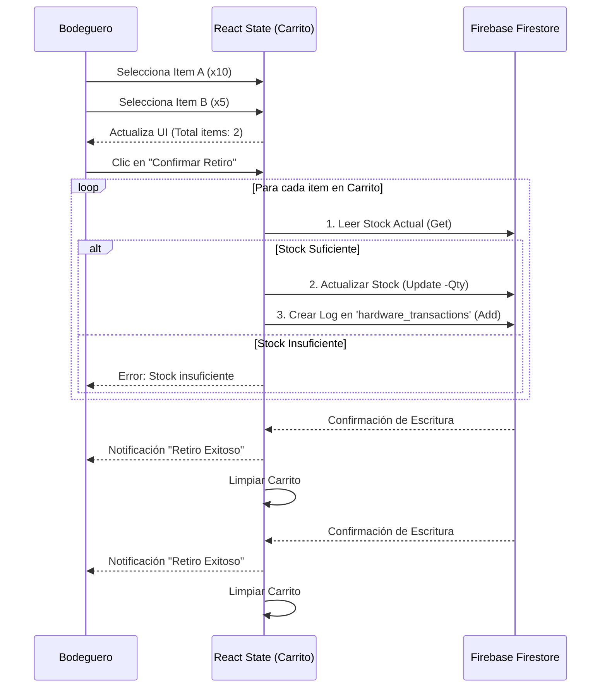

# 🏗️ Arquitectura del Sistema WMS - Telconor

Este documento describe las decisiones de diseño, el esquema de base de datos y los flujos de información críticos del Sistema de Gestión de Bodega.

## 1. Stack Tecnológico y Decisiones de Diseño

Para resolver la necesidad de **trazabilidad en tiempo real** y **movilidad en terreno**, se optó por una arquitectura **Serverless** (Sin servidor) basada en eventos.

* **Frontend (PWA):** React + Vite. Se eligió por su capacidad de manejar estados complejos (como el carrito de compras) y su compatibilidad con APIs de hardware (Cámara).
* **Backend (BaaS):** Firebase.
    * **Firestore:** Base de datos NoSQL documental. Elegida por su flexibilidad para manejar esquemas variantes (productos vs. activos fijos serializados).
    * **Auth:** Gestión de sesiones segura y persistente.
* **UI/UX:** TailwindCSS para un diseño *Mobile-First*, crítico para los técnicos que operan desde celulares.

---

## 2. Diseño de Base de Datos (Firestore Schema)

A diferencia de una base de datos SQL tradicional, aquí utilizamos un enfoque documental optimizado para lecturas rápidas.

### Colecciones Principales

| Colección | Descripción | Estructura Clave (JSON) |
| :--- | :--- | :--- |
| **`products`** | Inventario general (Cables, conectores). | `{ sku, name, stock, min, crit }` |
| **`antennas`** | Activos Fijos (Unitarios). | `{ mac, serial, model, status: 'DISPONIBLE'\|'ASIGNADA', location }` |
| **`hardware_items`** | Ferretería a granel. | `{ name, stock }` |
| **`technicians`** | Usuarios operativos. | `{ name }` |

### Colecciones de Logs (Trazabilidad)

Para garantizar la auditoría, cada movimiento genera un documento inmutable:

| Colección | Descripción | Estructura Clave |
| :--- | :--- | :--- |
| **`transactions`** | Movimientos de inventario general. | `{ productId, type: 'in'\|'out', qty, technician, date }` |
| **`antenna_transactions`** | Historial de vida de activos. | `{ type: 'ASIGNACION'\|'RECUPERACION', mac, serial, user, date }` |
| **`invoices`** | Respaldo digital de ingresos. | `{ number, fileBase64, items: [] }` |

---

## 3. Flujos de Datos Críticos

### A. Flujo de Ferretería: "El Carrito de Compras"

Este flujo resuelve el problema de los retiros múltiples. En lugar de hacer una transacción por tornillo, agrupamos las solicitudes en un estado local (`Cart State`) y ejecutamos una escritura por lotes (Batch).


B. Ciclo de Vida de un Activo Fijo (Antena)
```mermaid
stateDiagram-v2
    direction LR
    [*] --> Bodega: INGRESO (Nuevo)
    
    Bodega --> Terreno: ASIGNACIÓN
    Terreno --> Bodega: RECUPERACIÓN
    
    note right of Bodega
        Estado: DISPONIBLE
        Ubicación: Bodega Central
    end note

    note right of Terreno
        Estado: ASIGNADA
        Ubicación: En manos del Técnico
    end note
